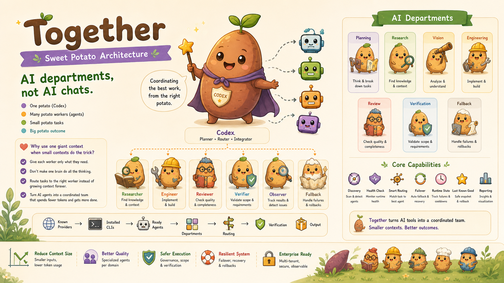

<p align="center">
  
</p>

<h1 align="center">together</h1>

<p align="center">
  <strong>Sweet Potato Architecture for local AI departments.</strong>
</p>

<p align="center">
  AI departments, not AI chats.
</p>

<p align="center">
  Together manages agents. It does not replace them.
</p>

<p align="center">
  Codex plans, coordinates, verifies, and integrates.
</p>

<p align="center">
  <a href="https://github.com/kyoo-147/together_working/stargazers">
    
  </a>
  <a href="https://github.com/kyoo-147/together_working/blob/main/LICENSE">
    
  </a>
  <a href="https://github.com/kyoo-147/together_working/commits/main">
    
  </a>
  
</p>

<p align="center">
  <a href="#install"><strong>Install</strong></a>
  |
  <a href="#quickstart"><strong>Quickstart</strong></a>
  |
  <a href="#how-it-works"><strong>How It Works</strong></a>
  |
  <a href="#governance-model"><strong>Governance</strong></a>
  |
  <a href="#repo-map"><strong>Repo Map</strong></a>
</p>

<p align="center">
  One potato. Many workers. Small tasks. Big outcomes.
</p>

<p align="center">
  Small contexts. Specialized workers. Better outcomes.
</p>

<p align="center">
  
</p>

## Product One-Liner

Together is AI Department Operating System for local AI worker teams.

It is:
- agent control plane
- work governance layer
- verification layer
- local routing and failover layer

It is not:
- another agent
- a replacement for Claude, Codex, Gemini, Amp, or other workers
- only an agent scanner

## Sweet Potato Architecture

- One potato: Codex
- Many potato workers: agents
- Small potato tasks
- Big potato outcome

Why this exists:
- giant contexts grow too expensive
- one worker should not own every step
- routing should be explicit
- verification should not be optional

## Install

Install full skill:

```bash
npx skills add https://github.com/kyoo-147/together_working
```

Install only main skill:

```bash
npx skills add https://github.com/kyoo-147/together_working --skill "together"
```

Skill entrypoint stays here:

```text
skills/together/SKILL.md
```

## Quickstart

Scan machine:

```bash
python skills/together/scripts/discover-agents.py --format table
```

Write operator snapshot:

```bash
python skills/together/scripts/doctor.py
```

Render report:

```bash
python skills/together/scripts/render-report.py
```

Run local release checks:

```bash
python scripts/release-check.py
```

## Commands

- `python skills/together/scripts/discover-agents.py --format table`
- `python skills/together/scripts/write-registry.py`
- `python skills/together/scripts/doctor.py`
- `python skills/together/scripts/render-report.py`
- `python scripts/validate-json.py`
- `python scripts/validate-registry.py`
- `python scripts/validate-routing.py`
- `python scripts/release-check.py`

Thin wrappers:
- `bin/together-scan`
- `bin/together-report`
- `bin/together-doctor`
- `bin/together-validate`

## How It Works

<p align="center">
  
</p>

```text
Known Providers
↓
Installed CLIs
↓
Ready Agents
↓
Departments
↓
Routing
↓
Verification
↓
Report
↓
Output
```

Stage meaning:
- `Known Providers`: curated ecosystem Together understands
- `Installed CLIs`: commands found on current machine
- `Ready Agents`: installed workers passing lightweight checks
- `Departments`: planning, research, vision, engineering, review, verification, fallback
- `Routing`: readiness-first and capability-aware
- `Verification`: scope, quality, and acceptance checks before merge
- `Report`: operator-readable snapshot

## Registry / Ready-State Model

<p align="center">
  
</p>

Three layers matter:
- `Known Providers` is ecosystem coverage, not local installation
- `Installed CLIs` is machine state
- `Ready Agents` is machine state plus health readiness

Health checks stay cheap:
- command exists
- help/version runs
- obvious auth/config failure detected
- permission-denied state detected

## Governance Model

<p align="center">
  
</p>

Together assumes workers need boundaries.

Rules:
- agent cannot do everything
- agent works only inside assigned scope
- review checks output quality
- verification checks contract and scope
- Codex decides merge and integration

Task contract fields:
- task id
- scope
- allowed files
- denied files
- deliverables
- success criteria
- reviewer required
- verification required

Permission model:
- Observer
- Researcher
- Implementer
- Reviewer
- Integrator

Codex defaults to Integrator.

## Department Workflow

<p align="center">
  
</p>

```text
Request
↓
Planning
↓
Research
↓
Vision
↓
Engineering
↓
Review
↓
Verification
↓
Integration
↓
Output
```

## Failover / Degraded Mode

<p align="center">
  
</p>

When a preferred worker fails:
- mark degraded
- start cooldown
- route to healthy fallback worker
- probe recovery later
- return to preferred worker when healthy again

## Examples

Committed, scrubbed examples:
- `examples/agent-registry.json`
- `examples/agent-report.md`
- `examples/last-known-good.json`
- `examples/runtime-state.json`
- `examples/providers.override.example.json`
- `examples/task-contract.example.yaml`

These are examples, not live runtime outputs.

## Repo Map

```text
skills/      installable skill entrypoint and compatibility scripts
docs/        product and system docs
examples/    committed sample outputs and templates
tests/       lightweight validation tests
bin/         thin wrappers around current Python scripts
commands/    operational command guides
src/         reusable Python helpers for validation and reporting
.github/     CI workflow
assets/      brand and screenshot notes
agents/      worker-specific guidance
```

## Generated Files Policy

Generated runtime output stays local and ignored:
- `.together/cache/*`
- `.together/reports/*`
- `.together/runtime-state.json`

Committed templates:
- `.together/providers.override.example.json`
- `examples/*`

## Documentation

- [PRODUCT.md](PRODUCT.md)
- [INSTALL.md](INSTALL.md)
- [CONTRIBUTING.md](CONTRIBUTING.md)
- [docs/architecture.md](docs/architecture.md)
- [docs/registry.md](docs/registry.md)
- [docs/routing.md](docs/routing.md)
- [docs/governance.md](docs/governance.md)
- [docs/observability.md](docs/observability.md)
- [docs/release.md](docs/release.md)
- [docs/distribution.md](docs/distribution.md)

## Roadmap

Near-term:
- stronger test coverage around routing and report generation
- more provider examples and safer public docs
- better release automation

Later:
- optional packaging improvements
- richer observability diffs
- more reusable orchestration helpers outside the skill layer

## Limits

- registry is curated, not exhaustive
- capability hints are routing hints, not benchmark claims
- failover is lightweight cooldown state, not a distributed scheduler
- Together manages workers. It does not replace them.

## License

MIT
