<p align="center">
  
</p>

<h1 align="center">together</h1>

<p align="center">
  <strong>Local Codex operator console for observable AI worker teams.</strong>
</p>

<p align="center">
  Chat in Codex. Watch the work in Together. Route, verify, review, and recover locally.
</p>

<p align="center">
  Together is a terminal-native control plane for scoped AI work, live worker output, agent readiness, review gates, and local-first execution history.
</p>

<p align="center">
  Codex stays the preferred integrator. Worker agents stay replaceable, scoped, and observable.
</p>

<p align="center">
  <a href="https://github.com/kyoo-147/together_working/stargazers">
    
  </a>
  <a href="https://github.com/kyoo-147/together_working/blob/main/LICENSE">
    
  </a>
  <a href="https://github.com/kyoo-147/together_working/commits/main">
    
  </a>
  
</p>

<p align="center">
  <a href="#install"><strong>Install</strong></a>
  |
  <a href="#quickstart"><strong>Quickstart</strong></a>
  |
  <a href="#how-it-works"><strong>How It Works</strong></a>
  |
  <a href="#governance-model"><strong>Governance</strong></a>
  |
  <a href="#repo-map"><strong>Repo Map</strong></a>
</p>

<p align="center">
  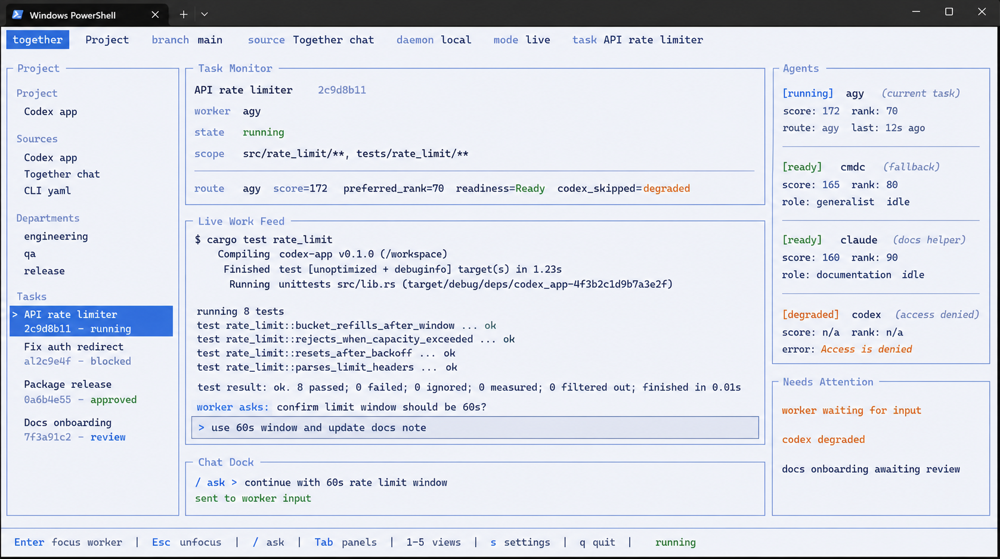
</p>

## Product One-Liner

Together is a local-first CLI/TUI control plane that lets developers keep working in Codex while seeing, routing, verifying, and reviewing the AI worker activity behind the scenes.

It is currently a dogfooding-stage operator console:
- `together` starts or connects to a local daemon.
- The terminal UI shows Project, Tasks, Task Monitor, Live Work Feed, Agents, Needs Attention, and Chat Dock.
- Codex app / skill requests and Together chat requests flow into the same daemon event log.
- Worker selection is deterministic and observable.
- Task contracts define scope, allowed files, denied files, deliverables, and success criteria.
- Verification and approval gates block unsafe or out-of-scope work.
- Settings, theme presets, status, review, and packaging commands are available from the CLI.

Longer-term, Together aims to become an AI Department Operating System for local and team AI worker workflows. The current product surface is the CLI/TUI operator cockpit.

It is:
- a terminal-native monitor for Codex-led AI work
- an agent control plane
- a work governance layer
- a verification and review gate
- a local routing and failover layer
- a measurement loop for real developer sessions

It is not:
- another AI assistant
- a replacement for Codex, Claude, Gemini, Amp, OpenCode, or other workers
- a generic terminal multiplexer
- a claim of finished enterprise orchestration

## Screenshots

### Monitor + Chat Dock

<p align="center">
  
</p>

### Featured Views

| Task Monitor | Tasks |
| --- | --- |
| 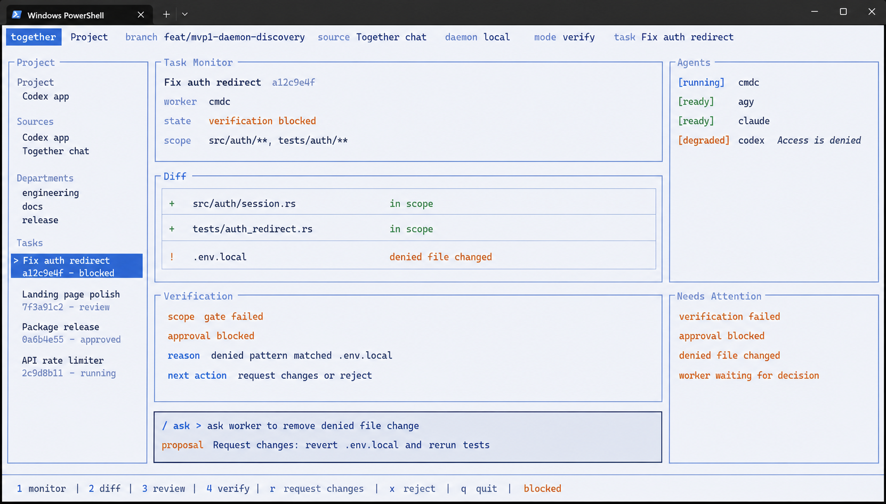 | 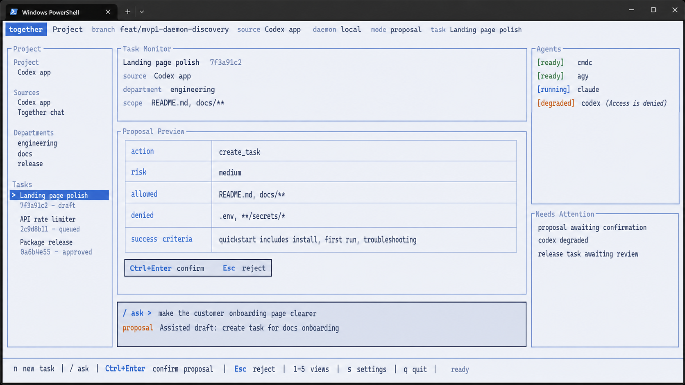 |

| Task Detail | Settings |
| --- | --- |
| 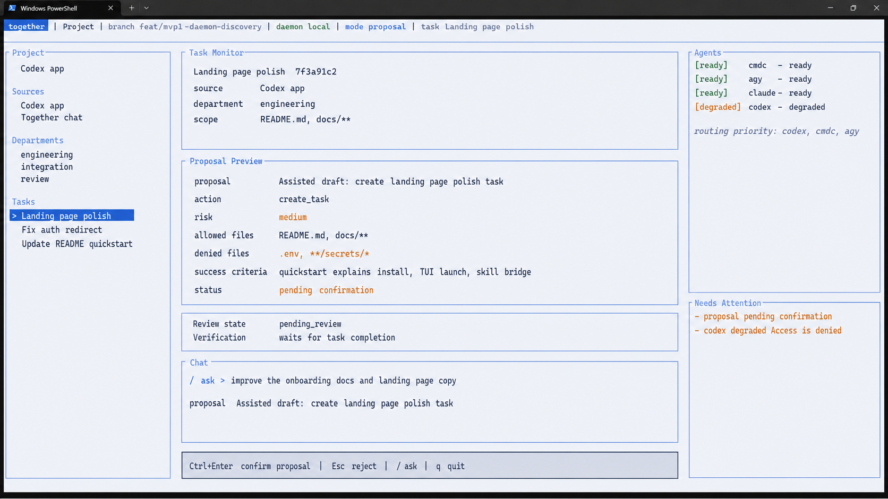 | 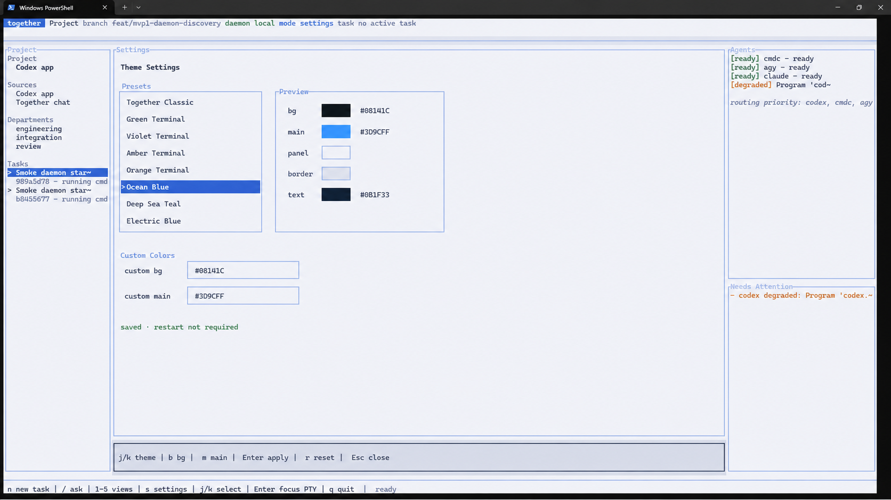 |

### Analysis Gallery

These mockups and analysis visuals capture the product direction behind the current interface.

| Architecture | Governance |
| --- | --- |
| 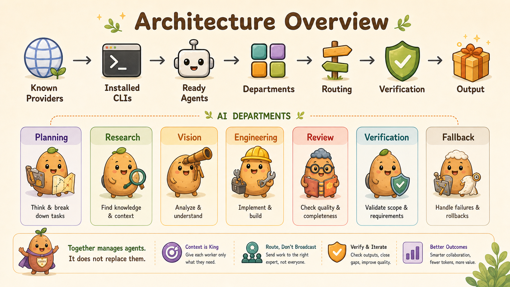 | 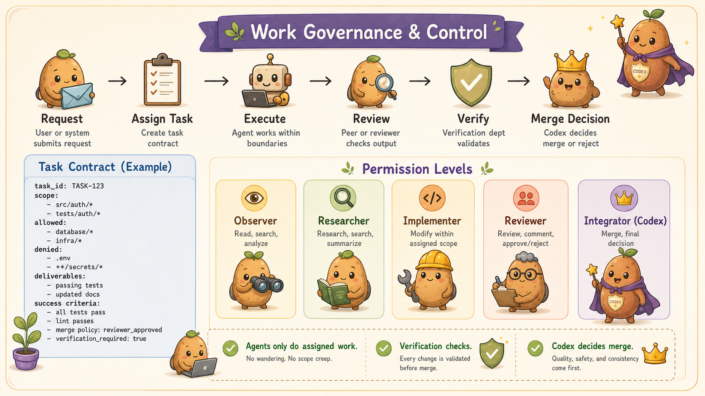 |

| Department Flow | Operations |
| --- | --- |
| 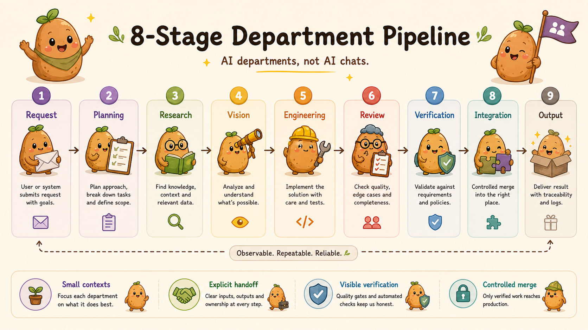 | 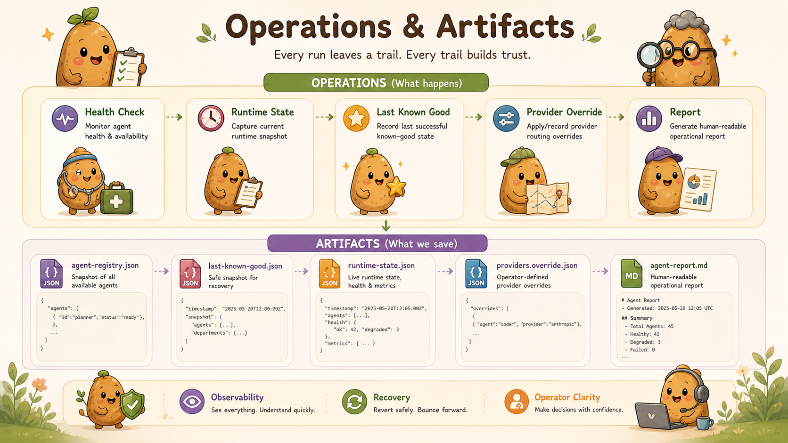 |

| Registry | Failover |
| --- | --- |
| 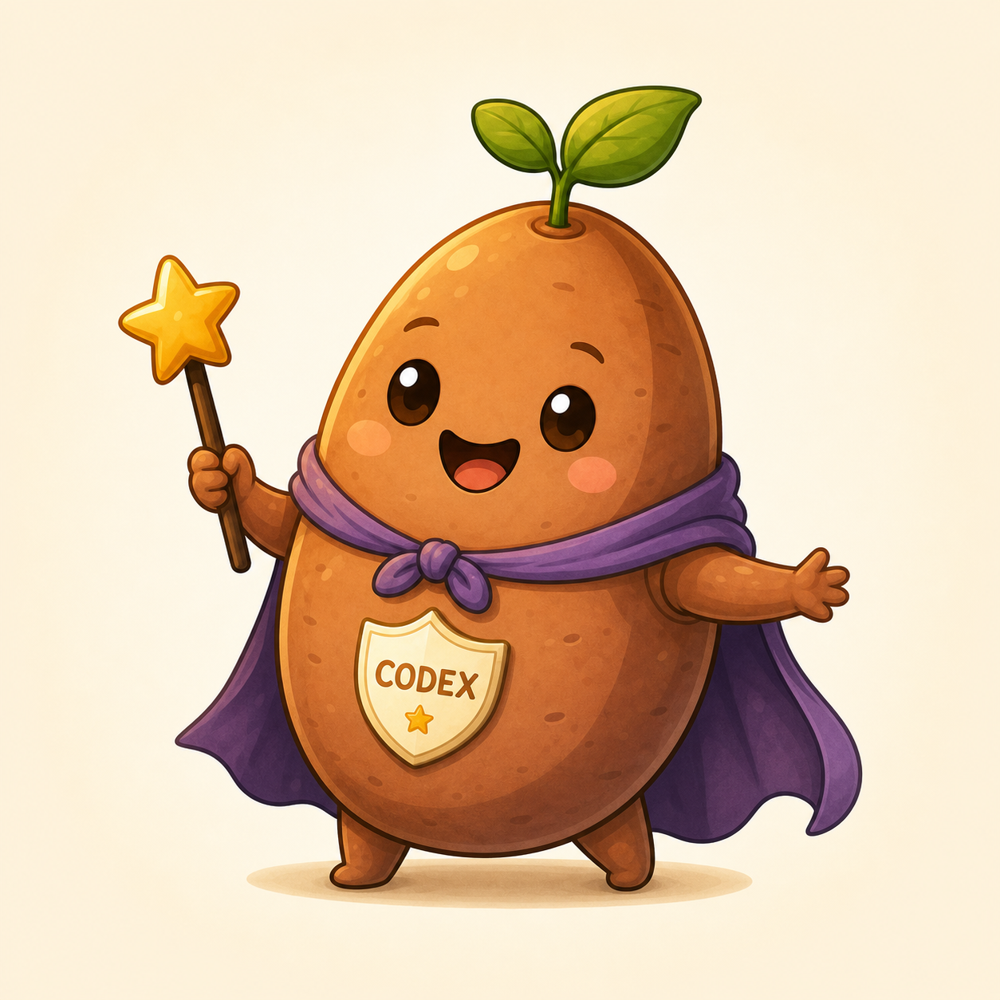 | 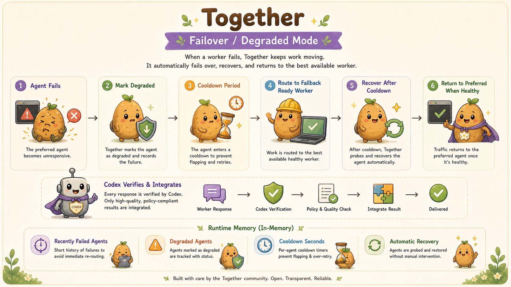 |

| Hero Concept | Ready-State Model |
| --- | --- |
|  | 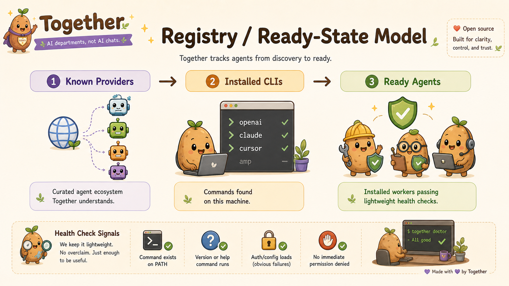 |

## Production Quickstart

For customers who just want to run Together:

```powershell
git clone https://github.com/kyoo-147/together_working.git
cd together_working
cargo build -p cli --release
target\release\together.exe
```

The terminal app auto-starts the local daemon, opens the Monitor + Chat Dock UI, and writes runtime state under `.together/`.

Useful CLI commands:

```powershell
target\release\together.exe doctor
target\release\together.exe status --json
target\release\together.exe chat --source codex-app "create a scoped landing page task"
target\release\together.exe proposal confirm <proposal-id>
target\release\together.exe settings set --theme "Ocean Blue"
```

Windows install/package helpers:

```powershell
powershell -ExecutionPolicy Bypass -File scripts\install.ps1 -AddToPath
powershell -ExecutionPolicy Bypass -File scripts\package-windows.ps1
```

Codex skill bridge:

```powershell
python skills\together\scripts\submit-chat.py "create a scoped task for the landing page"
```

The older Python scan/report commands remain available as compatibility tools for readiness reports.

## Product Principles

Together is built around a simple operating model:
- Codex is the preferred integrator.
- Workers are scoped and replaceable.
- Tasks are small enough to verify.
- Runtime state is observable.
- Approval depends on evidence, not trust.

Why this exists:
- giant contexts grow too expensive
- one worker should not own every step
- routing should be explicit
- verification should not be optional

## Install

Install full skill:

```bash
npx skills add https://github.com/kyoo-147/together_working
```

Install only main skill:

```bash
npx skills add https://github.com/kyoo-147/together_working --skill "together"
```

Skill entrypoint stays here:

```text
skills/together/SKILL.md
```

## Quickstart

Scan machine:

```bash
python skills/together/scripts/discover-agents.py --format table
```

Write operator snapshot:

```bash
python skills/together/scripts/doctor.py
```

List changed files:

```bash
python scripts/changed-files.py --json
```

Validate one task:

```bash
python scripts/validate-task.py examples/task-contract.example.yaml --mode warn
python scripts/validate-task.py examples/task-contract.example.yaml --mode strict --write-artifacts
```

Render report:

```bash
python skills/together/scripts/render-report.py
```

Run local release checks:

```bash
python scripts/release-check.py
```

## Commands

- `python skills/together/scripts/discover-agents.py --format table`
- `python skills/together/scripts/write-registry.py`
- `python skills/together/scripts/doctor.py`
- `python skills/together/scripts/render-report.py`
- `python scripts/validate-json.py`
- `python scripts/validate-registry.py`
- `python scripts/validate-routing.py`
- `python scripts/changed-files.py --json`
- `python scripts/validate-task.py examples/task-contract.example.yaml --mode warn`
- `python scripts/release-check.py`

Thin wrappers:
- `bin/together-scan`
- `bin/together-report`
- `bin/together-doctor`
- `bin/together-validate`

## How It Works

<p align="center">
  
</p>

```text
Known Providers
↓
Installed CLIs
↓
Ready Agents
↓
Departments
↓
Routing
↓
Verification
↓
Report
↓
Output
```

Stage meaning:
- `Known Providers`: curated ecosystem Together understands
- `Installed CLIs`: commands found on current machine
- `Ready Agents`: installed workers passing lightweight checks
- `Departments`: planning, research, vision, engineering, review, verification, fallback
- `Routing`: readiness-first and capability-aware
- `Verification`: scope, quality, and acceptance checks before merge
- `Report`: operator-readable snapshot

## Registry / Ready-State Model

<p align="center">
  
</p>

Three layers matter:
- `Known Providers` is ecosystem coverage, not local installation
- `Installed CLIs` is machine state
- `Ready Agents` is machine state plus health readiness

Health checks stay cheap:
- command exists
- help/version runs
- obvious auth/config failure detected
- permission-denied state detected

## Governance Model

<p align="center">
  
</p>

Together assumes workers need boundaries.

Rules:
- agent cannot do everything
- agent works only inside assigned scope
- review checks output quality
- verification checks contract and scope
- Codex decides merge and integration

Task contract fields:
- task id
- scope
- allowed files
- denied files
- deliverables
- success criteria
- reviewer required
- verification required

Permission model:
- Observer
- Researcher
- Implementer
- Reviewer
- Integrator

Codex defaults to Integrator.

What the current CLI/TUI product enforces now:
- task contract validation
- git diff changed-file capture
- scope guard
- file policy validation
- verification artifacts
- quality gate
- review and approval gate state
- daemon-owned settings and status
- proposal confirmation before mutation
- PTY-backed worker execution path
- degraded-agent fallback

What it does not do yet:
- distributed scheduling
- full enterprise RBAC or centralized audit
- adaptive routing trained on long execution history
- automatic agent sandboxing beyond local process/worktree boundaries
- automatic commit or PR creation

## Department Workflow

<p align="center">
  
</p>

```text
Request
↓
Planning
↓
Research
↓
Vision
↓
Engineering
↓
Review
↓
Verification
↓
Integration
↓
Output
```

## Failover / Degraded Mode

<p align="center">
  
</p>

When a preferred worker fails:
- mark degraded
- start cooldown
- route to healthy fallback worker
- probe recovery later
- return to preferred worker when healthy again

## Examples

Committed, scrubbed examples:
- `examples/agent-registry.json`
- `examples/agent-report.md`
- `examples/last-known-good.json`
- `examples/runtime-state.json`
- `examples/providers.override.example.json`
- `examples/task-contract.example.yaml`
- `examples/tasks/*`

These are examples, not live runtime outputs.

## Repo Map

```text
skills/      installable skill entrypoint and compatibility scripts
docs/        product and system docs
examples/    committed sample outputs and templates
tests/       lightweight validation tests
bin/         thin wrappers around current Python scripts
commands/    operational command guides
src/         reusable Python helpers for validation and reporting
.github/     CI workflow
assets/      brand and screenshot notes
agents/      worker-specific guidance
```

## Generated Files Policy

Generated runtime output stays local and ignored:
- `.together/cache/*`
- `.together/reports/*`
- `.together/runtime-state.json`

Committed templates:
- `.together/providers.override.example.json`
- `examples/*`

## Documentation

- [PRODUCT.md](PRODUCT.md)
- [INSTALL.md](INSTALL.md)
- [CONTRIBUTING.md](CONTRIBUTING.md)
- [docs/architecture.md](docs/architecture.md)
- [docs/registry.md](docs/registry.md)
- [docs/routing.md](docs/routing.md)
- [docs/governance.md](docs/governance.md)
- [docs/enforcement.md](docs/enforcement.md)
- [docs/benchmarking.md](docs/benchmarking.md)
- [docs/task-workflow.md](docs/task-workflow.md)
- [docs/observability.md](docs/observability.md)
- [docs/release.md](docs/release.md)
- [docs/distribution.md](docs/distribution.md)

## Roadmap

Near-term:
- dogfood the Monitor + Chat Dock UI in real developer sessions
- improve benchmark and telemetry capture for task latency, fallback, verification, and retries
- polish review, diff, settings, and compact terminal views
- strengthen Codex skill/app bridge documentation
- expand provider adapter tests and readiness diagnostics

Later:
- team policy templates
- CI and PR integration
- richer execution history and adaptive routing
- optional sandbox profiles
- multi-machine worker pools

## Limits

- registry is curated, not exhaustive
- capability hints are routing hints, not benchmark claims
- failover is lightweight cooldown state, not a distributed scheduler
- Together manages workers. It does not replace them.

## License

MIT
